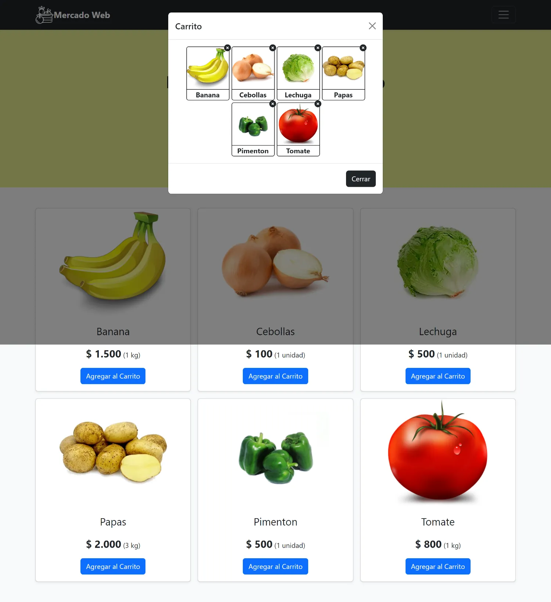

# Código Solución Desafío Mercado web

El presente repositorio contiene el código solución al segundo desafío del módulo 6 llamado **Desarrollo de aplicaciones web con Node y Express** de la beca **Desarrollo de aplicaciones Full Stack Javascript Trainee** dictada por Desafío Latam.

Las tecnologías utilizadas fueron las siguientes:


Junto con la librería **express-handlebars** para servir vistas desde el servidor.

Los requisitos del proyecto son los siguientes:


A continuación muestro un screenshot del proyecto completo:


A continuación explico cada uno de los requisitos que han sido cumplidos:

## 1. Crear una ruta raíz que al ser consultada renderice una vista con un parcial “Dashboard” enviándole en el render un arreglo con los nombres de los productos. Se recomienda que estos coincidan con las imágenes de cada producto. (3 Puntos)

El siguiente código renderiza la vista llamada **inicio** a la cual se le envia un array llamado **datos** con datos de los productos:

```js
const datos = [
  { articulo: "banana", precio: "1500", medida: "1", unidad: "kg" },
  { articulo: "cebollas", precio: "100", medida: "1", unidad: "unidad" },
  { articulo: "lechuga", precio: "500", medida: "1", unidad: "unidad" },
  { articulo: "papas", precio: "2000", medida: "3", unidad: "kg" },
  { articulo: "pimenton", precio: "500", medida: "1", unidad: "unidad" },
  { articulo: "tomate", precio: "800", medida: "1", unidad: "kg" },
];

app.get("/", (req, res) => {
  res.render("inicio", { datos });
});
```

Como se puede observar, he creado un array de objetos que almacena distinta data referida a cada producto.

La vista **inicio** contiene el siguiente parcial:

```hbs
{{> Menu}}
{{>Dashboard datos=datos}}
```

Cuando se ingresa a la ruta raíz se renderiza la vista **inicio** la cual contiene el partial **Dashboard** cumpliendo con lo solicitado.

## 2. Incluir en la vista un parcial que contenga el menú del sitio web y sea renderizado antes del Dashboard. (2 Puntos)

El partial solicitado lo he llamado **Menu** el cual contiene el siguiente código handlebars:

```hbs
<header>
  <div class="navbar navbar-dark bg-dark shadow-sm">
    <div class="container">
      <a href="#" class="navbar-brand d-flex align-items-center">
        
        <strong>Mercado Web</strong>
      </a>
      <button
        class="navbar-toggler"
        type="button"
        data-bs-toggle="collapse"
        data-bs-target="#navbarHeader"
        aria-controls="navbarHeader"
        aria-expanded="false"
        aria-label="Toggle navigation"
      >
        <span class="navbar-toggler-icon"></span>
      </button>
    </div>
  </div>
  <div class="collapse bg-dark text-white" id="navbarHeader">
    <div class="container">
      <div class="row">
        <ul class="list-unstyled text-center">
          <li class="nav-item">
            <a class="nav-link" href="#">Home</a>
          </li>
          <li class="nav-item">
            <a class="nav-link" href="#">Productos</a>
          </li>
          <li class="nav-item">
            <a class="nav-link" href="#">Contacto</a>
          </li>
        </ul>
      </div>
    </div>
  </div>
</header>
```

## 3. Crear un parcial “producto” que contenga el template correspondiente a la presentación de cada producto en el Dashboard y reciba como parámetro el nombre del producto. (2 Puntos)

He creado el partial **Producto** el cual contiene el siguiente template:

```hbs
<div class="col">
  <div class="card shadow-sm align-items-center">
    
    <div class="card-body">
      <p class="card-text card_producto_descripcion">
        {{primeraMayuscula this.articulo}}
      </p>
      <p class="card_producto_precio">
        <span>$ {{formatearNumber this.precio}}</span>
        ({{this.medida}}
        {{this.unidad}})
      </p>
      <div class="d-flex justify-content-center align-items-center">
        <button type="button" class="btn btn-primary boton_agregar_carrito">
          Agregar al Carrito
        </button>
      </div>
    </div>
  </div>
</div>
```

Dicho partial recibe un elemento del array **datos** para tomar propiedades y posicionarlas en diferentes lugares del template.

## 4. Crear un parcial para la sección principal en donde se renderice un helper con el mensaje de bienvenida y se realice una iteración para renderizar un parcial “producto” pasándole como argumento el nombre de cada producto. (2 Puntos)

El partial solicitado lo he denominado **Dashboard** el cual contiene una sección hero junto con la lista de productos. Dicho partial es el siguiente:

```hbs
<main>
  {{>Hero}}
  <div class="album py-5 bg-light">
    <div class="container">
      <div class="row row-cols-1 row-cols-sm-2 row-cols-md-3 g-3">
        {{#each datos}}
        {{>Producto this }}
        {{/each}}
      </div>
    </div>
  </div>
</main>
```

En el partial **Hero** que corresponde al siguiente código:

```hbs
<div style="background-color: rgb(230, 236, 145)">
  <section class="py-5 text-center container mx-auto">
    <div class="row py-lg-5">
      <div class="col-lg-6 col-md-8 mx-auto">
        {{#boldHeroTitle}}Bievenidos a Mercado Web{{/boldHeroTitle}}
        <p class="lead">Tienda en Línea de venta de frutas y vegetales</p>
        <p>
          <button id="btn_show_carrito" class="btn btn-success my-2">
            Ver Carrito
            <i class="fa-solid fa-cart-shopping"></i>
            <span class="hero_ver_carrito_cuenta"> 0 </span>
          </button>
        </p>
      </div>
    </div>
  </section>
</div>
```

En dicho código he utilizado el **helper** llamado **boldHeroTitle** el cual lo he establecido en el index.js. Dicho helper envuelve el texto **Bievenidos a Mercado Web** en un tag **h1** y le aplica la clase de bootstrap **fw-bold**:

```js
app.engine(
  ".hbs",
  exphbs.engine({
    extname: ".hbs",
    helpers: {
      formatearNumber: function (numberString) {
        return (+numberString).toLocaleString();
      },
      primeraMayuscula: function (texto) {
        return texto.charAt(0).toUpperCase() + texto.slice(1);
      },
      boldHeroTitle: function (options) {
        return '<h1 class="fw-bold">' + options.fn(this) + "</h1>";
      },
    },
  })
);
```

Por último, itero sobre el array **datos** pasandole el elemento respectivo del array al partial **Producto**.

## 5. Consumir los códigos fuentes de Bootstrap y jQuery a través de rutas o middlewares creados en el servidor. Estas dependencias deben ser instaladas con NPM (1 punto)

He consumido los códigos fuentes a través de las siguientes rutas:

```js
app.use("/bootstrap_css", express.static("./node_modules/bootstrap/dist/css"));
app.use("/bootstrap_js", express.static("./node_modules/bootstrap/dist/js"));
app.use("/jquery", express.static("./node_modules/jquery/dist"));
```

Y como se puede observar en el proyecto, he realizado uso de ambas librerías para crear el proyecto. La utilización de **JQuery** la realizo de lado del cliente por medio del script llamado **control.js** el cual esta ubicado en la carpeta **public** la cual la hago disponible utilizando el siguiente código:

```js
app.use("/public", express.static("./public"));
```

Dicha manipulación permite agregar las funcionalidades siguientes:

## 1. Agregar Productos al Carrito

Carrito con 6 productos agregados al hacer click en los botones **Agregar al Carrito** respectivos:


## 2. Modal con productos del carrito mostrados

Cuando se hace click en el botón de la hero section se muestra un modal con los productos agregados al carrito:



## 3. Modal con todos los productos del carrito eliminados

Cuando se eliminan todos los productos del carrito al hacer click en el icono de eliminación de cada card con símbolo de **x**, se muestra un mensaje en el modal:


